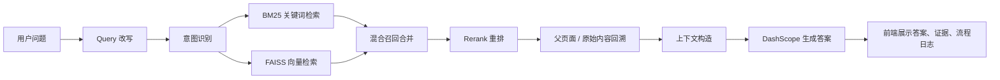

# AI助教进阶RAG系统开发计划

## 1. 项目背景

本项目目标是基于当前工作区内的两类知识库，搭建一个适合学习和演示的进阶 RAG 系统工程。

当前使用的数据源：

1. 课程视频知识库
   - 路径：`课程视频知识库\视频_json_excel`
   - 重点文件：`video-all.xlsx`
   - 主要字段：`questions`、`content`、`image`
   - 数据特点：每条记录包含一组由 `||` 分隔的问题，以及对应课程视频片段内容。

2. 微信群问答知识库
   - 路径：`微信群问答知识库\问题列表转excel`
   - 重点文件：`AI解决方案专家-答疑汇总-all.xlsx`
   - 主要字段：`questions`、`content`
   - 数据特点：每条记录包含一组由 `||` 分隔的问题，以及对应答疑内容。

项目定位：

- 面向 RAG 初学者。
- 不只追求“能回答”，还要展示“为什么这么回答”。
- 每一个模块都要尽量写清楚代码注释，帮助理解工程架构。
- 前端要展示用户输入、检索过程、召回证据、最终答案和调试信息。

## 2. 总体目标

最终完成一个可以在页面上提问的 AI 助教系统：

1. 用户在前端输入问题。
2. 系统对问题做 query 改写和意图识别。
3. 系统使用 BM25、FAISS、混合检索等方法召回知识库内容。
4. 系统对召回内容做 rerank。
5. 系统根据命中的 chunk 回溯父页面或原始内容。
6. 系统构造包含 query 和召回数据的上下文。
7. 系统调用 DashScope LLM 生成最终答案。
8. 前端展示最终答案、召回证据、检索链路和可解释推理过程。

注意：

- 页面中展示的是“可解释推理过程 / 检索过程日志”，不是模型内部不可控的原始思维链。
- LLM 相关能力使用 DashScope。
- embedding 模型使用 DashScope text-embedding。
- rerank 模型后续再根据 DashScope 当前可用模型确认。

## 3. 推荐技术栈

前端：

- 推荐使用 `Streamlit`
- 原因：适合快速做 RAG 调试界面、参数面板、召回结果表格和流程日志展示。

后端：

- Python 模块化工程
- 第一阶段不急着上 FastAPI，先把本地工程跑通。

核心组件：

- 数据读取：`pandas`
- 向量库：`FAISS`
- 关键词检索：`BM25`
- 中文分词：`jieba`
- LLM 调用：`dashscope`
- Embedding：DashScope text-embedding
- 前端：`streamlit`

## 4. RAG 总流程



## 5. 推荐项目结构

后续建议在项目根目录下创建如下结构：

```text
ai_tutor_rag/
  app.py
  config.py
  requirements.txt

  data/
    raw/
    processed/

  indexes/
    faiss/
    bm25/
    metadata/

  src/
    data_loader.py
    cleaner.py
    chunker.py
    embeddings.py
    vector_store.py
    bm25_store.py
    query_rewriter.py
    intent_classifier.py
    retriever.py
    reranker.py
    parent_retriever.py
    prompt_builder.py
    generator.py
    pipeline.py

  docs/
    01_项目总览_思维导图.md
    02_数据清洗与chunk.md
    03_FAISS向量库.md
    04_BM25混合检索.md
    05_Query改写与意图识别.md
    06_Rerank与父页面检索.md
    07_上下文构造与答案生成.md
```

## 6. 统一数据格式设计

两个知识库需要先统一成一种内部数据结构，推荐字段如下：

```text
doc_id          原始文档编号
chunk_id        chunk 编号
parent_id       父文档编号
source_type     数据来源类型：video 或 wechat_qa
source_file     来源文件名
title           可选标题
questions       问题别名列表
content         原始正文内容
image           图片字段，视频知识库可能存在
metadata        其他元数据
```

设计原则：

- `questions` 主要用于提高召回率。
- `content` 才是最终回答时应优先引用的知识正文。
- 如果命中了某个问题别名，需要映射回对应的 `content`。
- 第一版可以采用“一行 Excel 数据 = 一个父文档 = 一个 chunk”的简化方式。
- 后续如果 content 变长，再引入更细粒度 chunk。

## 7. 分阶段开发计划

### 第 1 阶段：项目骨架和数据标准化

目标：

- 创建 `ai_tutor_rag` 工程目录。
- 创建基础模块文件。
- 读取两个 Excel 汇总文件。
- 清洗数据并统一成 JSONL。
- 输出 `data/processed/knowledge_base.jsonl`。

交付物：

- `src/data_loader.py`
- `src/cleaner.py`
- `data/processed/knowledge_base.jsonl`
- `docs/01_项目总览_思维导图.md`

学习重点：

- 为什么要先做统一 schema。
- 为什么 questions 是召回别名，而 content 是回答依据。
- 什么是 doc、parent、chunk。

### 第 2 阶段：FAISS 基础向量检索 MVP

目标：

- 调用 DashScope text-embedding 对知识库内容向量化。
- 构建 FAISS 向量库。
- 保存向量索引和 metadata。
- 支持输入问题后返回 top-k 召回结果。

交付物：

- `src/embeddings.py`
- `src/vector_store.py`
- `indexes/faiss/`
- `indexes/metadata/`

学习重点：

- embedding 是什么。
- FAISS 保存的是什么。
- metadata 为什么必须和向量索引分开保存。

### 第 3 阶段：基础问答链路

目标：

- 将用户问题向量化。
- 从 FAISS 召回相关内容。
- 构造 prompt。
- 调用 DashScope LLM 生成答案。

交付物：

- `src/prompt_builder.py`
- `src/generator.py`
- `src/pipeline.py`

学习重点：

- RAG 不是直接把问题交给模型。
- RAG 的关键是先检索，再把证据交给模型。
- prompt 中应该包含用户问题、召回内容和回答要求。

### 第 4 阶段：Streamlit 前端

目标：

- 页面左侧放用户输入和参数。
- 页面右侧展示答案、召回证据和流程日志。
- 支持调整 top-k、知识库范围、是否展示调试信息。

交付物：

- `app.py`

前端布局建议：

- 左侧：
  - 问题输入框
  - 知识库范围选择
  - top-k 参数
  - 检索模式选择
  - 是否显示调试信息

- 右侧：
  - 最终答案
  - 召回证据
  - 检索过程
  - Query 改写结果
  - 意图识别结果
  - 原始上下文

学习重点：

- RAG 系统前端不仅是聊天框。
- 对学习者来说，流程可视化比单纯回答更重要。

### 第 5 阶段：BM25 和混合检索

目标：

- 为知识库构建 BM25 关键词索引。
- 支持关键词召回。
- 将 BM25 和 FAISS 结果合并去重。
- 根据分数或排序策略生成混合召回结果。

交付物：

- `src/bm25_store.py`
- `src/retriever.py`

学习重点：

- BM25 更擅长关键词精确匹配。
- FAISS 更擅长语义相似匹配。
- 混合检索可以同时兼顾“关键词”和“语义”。

### 第 6 阶段：Query 改写和意图识别

目标：

- 使用 DashScope 对用户问题进行 query 改写。
- 输出标准 JSON，例如：

```json
{
  "standalone_query": "改写后的独立问题",
  "search_queries": ["检索问题1", "检索问题2"],
  "keywords": ["关键词1", "关键词2"],
  "intent": "concept_explain",
  "entities": ["实体1", "实体2"]
}
```

交付物：

- `src/query_rewriter.py`
- `src/intent_classifier.py`

学习重点：

- 用户问题经常不适合直接检索。
- Query 改写是为了提高召回率。
- 原始问题一定要保留，作为兜底检索条件。

### 第 7 阶段：Rerank 和父页面检索

目标：

- 对初步召回结果进行 rerank。
- 命中 questions 或小 chunk 后，回到对应 parent content。
- 最终生成答案时使用原始正文内容，而不是只使用问题别名。

交付物：

- `src/reranker.py`
- `src/parent_retriever.py`

学习重点：

- 初步召回不等于最终证据。
- Rerank 的作用是重新判断“哪些内容最适合回答这个问题”。
- 父页面检索可以避免回答上下文过碎。

### 第 8 阶段：可解释日志和学习文档

目标：

- 每次提问时生成结构化流程日志。
- 前端展示每一步发生了什么。
- 每个模块配一份学习文档和 Mermaid 图。

交付物：

- `docs/02_数据清洗与chunk.md`
- `docs/03_FAISS向量库.md`
- `docs/04_BM25混合检索.md`
- `docs/05_Query改写与意图识别.md`
- `docs/06_Rerank与父页面检索.md`
- `docs/07_上下文构造与答案生成.md`

学习重点：

- 工程系统要能观察。
- RAG 调优依赖可解释日志。
- 能看到召回证据，才知道答案靠不靠谱。

## 8. 后续每一步开发的工作约定

后续每推进一个阶段，都要遵守以下约定：

1. 先说明本阶段要做什么。
2. 再说明为什么要这么做。
3. 再修改或新增代码。
4. 代码中尽量写学习型注释。
5. 运行必要的验证命令。
6. 最后总结：
   - 新增了哪些文件
   - 修改了哪些文件
   - 当前能运行到哪一步
   - 下一步建议做什么

代码注释风格要求：

- 关键函数要写 docstring。
- 对新手不容易理解的步骤，要写清楚原因。
- 不写无意义注释，例如“给变量赋值”。
- 重点解释：
  - 输入是什么
  - 输出是什么
  - 为什么要有这个模块
  - 这个模块在 RAG 流程中的位置

示例：

```python
def build_documents_from_excel_rows(rows):
    """
    将 Excel 中的一行行原始数据转换成 RAG 系统内部统一使用的文档结构。

    为什么要做这一步：
    - 视频知识库和微信群问答知识库虽然字段相似，但来源不同。
    - 后续向量化、BM25、rerank 都不应该直接依赖 Excel 原始格式。
    - 统一 schema 后，后面的模块只需要处理标准 Document 对象。
    """
```

## 9. 新聊天窗口续接提示词

如果后续开启新的聊天窗口，可以把下面这段话发给 Codex：

```text
我们正在开发一个 AI助教进阶RAG系统，工作区路径是：
D:\BaiduSyncdisk\大模型应用开发学习\23期学习内容（2026-05-24）\AI助教相关数据

请先阅读项目根目录下的《AI助教RAG项目开发计划.md》。

本项目使用两个知识库：
1. 课程视频知识库\视频_json_excel
   重点文件：video-all.xlsx
2. 微信群问答知识库\问题列表转excel
   重点文件：AI解决方案专家-答疑汇总-all.xlsx

项目目标：
- 使用 Streamlit 做前端。
- 使用 DashScope 做 LLM 调用。
- 使用 DashScope text-embedding 做向量化。
- 使用 FAISS 做向量库。
- 实现 query 改写、意图识别、BM25、混合检索、rerank、父页面检索、上下文构造、答案生成和可解释流程展示。

我是 RAG 初学者。每一步开发时，请先告诉我本阶段做什么和为什么这么做；代码里请尽量写清楚学习型注释，帮助我理解架构。

请从计划中的下一阶段继续推进，不要跳过验证。
```

## 10. 当前建议的下一步

建议下一步从第 1 阶段开始：

1. 创建 `ai_tutor_rag` 工程目录。
2. 创建基础 Python 模块。
3. 读取两个 Excel 汇总文件。
4. 生成统一的 `knowledge_base.jsonl`。
5. 生成第一份学习文档 `docs/01_项目总览_思维导图.md`。

