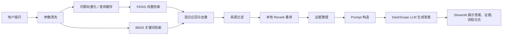

这是一个100% Vibe coding的项目。适合新手学习。 分不同阶段开发，方便新手看懂代码， 注释也写了很多。
主要理解RAG的工作流程， 太细节的传参部分不用过多纠结  ， 项目也不是商用项目。
调试台界面增加了很多流程展示， 方便学习步骤。


# AI助教进阶 RAG 项目说明

这是一个面向初学者的中文 RAG 学习项目，目标不是只做出“能回答问题”的系统，而是把一套可观察、可调试、可逐步理解的 AI 助教工程搭起来。

当前项目已经完成了从知识库标准化、FAISS 向量检索、BM25 关键词检索，到混合检索、本地 Rerank、DashScope 答案生成、Streamlit 可视化调试台的一条完整主链路。

## 1. 项目目标

这个项目希望解决两件事：

1. 把课程资料和微信群答疑整理成一个统一知识库。
2. 搭建一个可以展示“检索过程 + 证据来源 + 最终答案”的教学型 RAG 系统。

和普通聊天机器人不同，这个项目更强调：

- 能看到检索证据来自哪里。
- 能看到 FAISS、BM25、Rerank、Prompt、LLM 各阶段做了什么。
- 代码注释尽量写清楚，适合初学者逐步阅读。

## 2. 当前项目结构

当前工作区由“原始知识数据”与“Python 工程”两部分组成：

```text
AI助教相关数据/
├─ README.md
├─ AI助教RAG项目开发计划.md
├─ 课程视频知识库/
├─ 微信群问答知识库/
├─ coze知识库/
└─ ai_tutor_rag/
   ├─ app.py
   ├─ ask.py
   ├─ build_knowledge_base.py
   ├─ build_vector_index.py
   ├─ build_bm25_index.py
   ├─ download_reranker_model.py
   ├─ test_dashscope_api.py
   ├─ config.py
   ├─ requirements.txt
   ├─ docs/
   ├─ src/
   ├─ data/
   ├─ indexes/
   └─ models/
```

其中：

- `课程视频知识库/`：课程视频整理出来的知识源。
- `微信群问答知识库/`：微信群答疑整理出来的知识源。
- `ai_tutor_rag/`：真正的 RAG Python 工程目录。
- `ai_tutor_rag/docs/`：按阶段写的学习笔记与流程说明。

## 3. 知识库来源

当前主要使用两类知识库：

### 课程视频知识库

- 路径：`课程视频知识库/视频_json_excel/video-all.xlsx`
- 主要字段：`questions`、`content`、`image`
- 特点：一条记录往往对应一个课程主题或视频知识点

### 微信群问答知识库

- 路径：`微信群问答知识库/问题列表转excel/AI解决方案专家-答疑汇总-all.xlsx`
- 主要字段：`questions`、`content`
- 特点：一条记录包含一个问题及其若干改写问法，正文是答疑内容

## 4. 当前统一数据格式

项目先把 Excel 原始数据统一成 JSONL，每一行是一条标准知识记录。当前采用的核心设计是：

- `row_as_chunk`
- 一行 Excel = 一个知识点 = 一个 chunk
- `questions` 用作召回别名
- `content` 是最终回答时优先引用的证据正文

标准记录里会包含这些核心字段：

```text
doc_id
chunk_id
parent_id
source_type
source_file
title
questions
content
image
retrieval_text
metadata
```

当前已验证的知识库产物：

- 标准数据文件：`ai_tutor_rag/data/processed/knowledge_base.jsonl`
- 统计文件：`ai_tutor_rag/data/processed/knowledge_base_stats.json`
- 记录数：2915
- 问题别名总数：16433

## 5. 关键流程

项目当前主流程如下：



可以把它理解成 5 个阶段：

### 阶段 1：知识库标准化

- 脚本：`ai_tutor_rag/build_knowledge_base.py`
- 作用：读取两个 Excel，清洗成统一 JSONL
- 重点：让后续所有模块都只依赖标准数据，不直接依赖 Excel 原始格式

### 阶段 2：FAISS 向量索引

- 脚本：`ai_tutor_rag/build_vector_index.py`
- Embedding 模型：`tongyi-embedding-vision-flash-2026-03-06`
- 向量维度：`768`
- 产物：
  - `ai_tutor_rag/indexes/faiss/knowledge_base.index`
  - `ai_tutor_rag/indexes/metadata/knowledge_base_metadata.jsonl`
  - `ai_tutor_rag/indexes/metadata/knowledge_base_manifest.json`

### 阶段 3：基础问答链路

- 入口：`ai_tutor_rag/ask.py`
- 核心模块：`ai_tutor_rag/src/pipeline.py`
- LLM 模型：`qwen3.6-flash`
- 作用：把检索结果组织成 Prompt，再调用 LLM 生成最终回答

### 阶段 4：Streamlit 调试前端

- 入口：`ai_tutor_rag/app.py`
- 作用：把提问、证据、分数、流程日志都展示出来
- 特点：不是普通聊天页，而是教学型 RAG 调试台

### 阶段 5：混合检索 + 本地 Rerank

- BM25 脚本：`ai_tutor_rag/build_bm25_index.py`
- 本地重排模型：`BAAI/bge-reranker-base`
- 作用：
  - BM25 负责关键词精确匹配
  - FAISS 负责语义相似召回
  - Rerank 负责对候选证据重新排序

## 6. 关键模块说明

`ai_tutor_rag/src/` 下的主要模块职责如下：

- `data_loader.py`：读取 Excel 原始数据
- `cleaner.py`：把原始数据清洗成统一记录
- `embeddings.py`：封装 DashScope Embedding 调用与查询向量缓存
- `vector_store.py`：封装 FAISS 索引构建、保存、加载与搜索
- `bm25_store.py`：构建和查询 BM25 索引
- `retriever.py`：组合 FAISS、BM25、混合检索与来源过滤
- `reranker.py`：本地 Rerank 重排序
- `prompt_builder.py`：把问题和证据整理成可控 Prompt
- `generator.py`：调用 DashScope LLM 生成答案
- `pipeline.py`：把检索、重排、Prompt、生成串成完整问答链路

## 7. 当前配置要点

当前项目里几项比较关键的配置如下：

- Python 环境建议：使用当前已激活环境中的 `python`
- Embedding 模型：`tongyi-embedding-vision-flash-2026-03-06`
- LLM 模型：`qwen3.6-flash`
- LLM Base URL：DashScope OpenAI 兼容接口
- 默认 `top-k`：`5`
- 默认开启流式输出：`True`
- 当前已接入查询向量缓存，减少重复问题的远程向量化开销

API Key 使用环境变量：

```powershell
$env:DASHSCOPE_API_KEY="你的 Key"
```

## 8. 如何运行

下面的命令建议在 `ai_tutor_rag/` 目录下执行。
如果你使用虚拟环境，也可以把下面的 `python` 替换成相对路径形式，例如 `.\.venv\Scripts\python.exe`。

### 1. 安装依赖

```powershell
python -m pip install -r requirements.txt
```

### 2. 测试 DashScope Embedding 是否可用

```powershell
python test_dashscope_api.py
```

### 3. 重新构建标准知识库

```powershell
python build_knowledge_base.py
```

### 4. 构建 FAISS 向量索引

```powershell
python build_vector_index.py
```

首次学习时，也可以先做小样本验证：

```powershell
python build_vector_index.py --limit 30
```

### 5. 构建 BM25 索引

```powershell
python build_bm25_index.py
```

### 6. 命令行提问

```powershell
python ask.py "coze平台怎么注册并开始实践？" --show-debug
```

### 7. 启动 Streamlit 页面

```powershell
python -m streamlit run app.py
```

## 9. 当前前端能看到什么

当前 Streamlit 页面已经支持：

- 输入用户问题
- 选择知识库范围
- 调整 `top-k`
- 选择检索模式：`faiss` / `bm25` / `hybrid`
- 选择是否启用本地 Rerank
- 查看最终答案
- 查看证据表格和证据正文
- 查看执行流程、耗时、模型信息和 token 用量

这让它更像一个“RAG 学习实验台”，而不是只有一个输入框的聊天机器人。


## 11. 建议的后续方向

当前主链路已经跑通，接下来可以继续完善这些方向：

1. 增加 Query 改写与意图识别模块，并正式接入主链路。
2. 增加父页面回溯或更细粒度 chunk 策略。
3. 把检索评估、问答评估做成可重复实验。
4. 对不同知识源做单独统计和召回质量对比。
5. 增加更完整的部署说明和环境配置模板。

