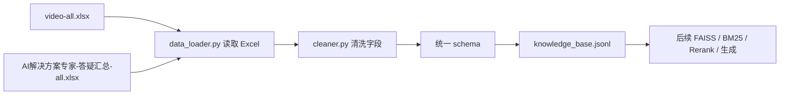
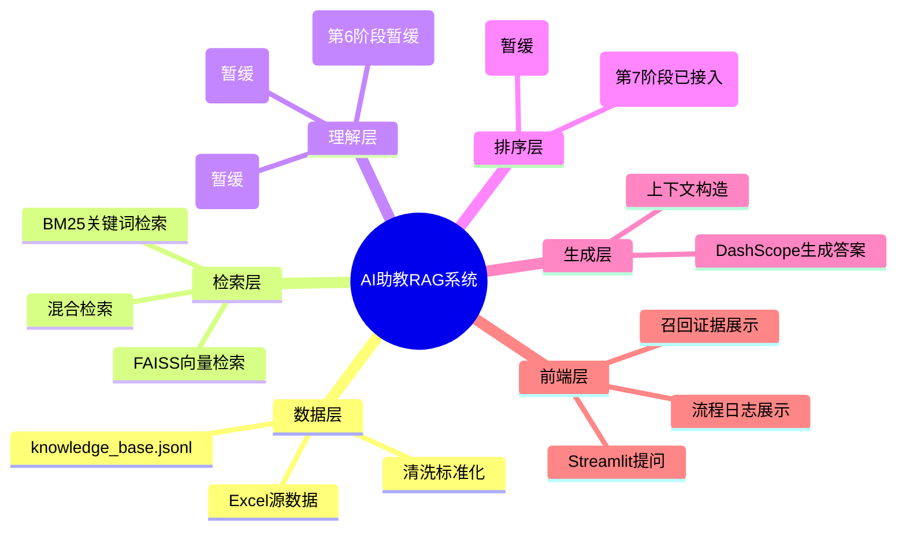

# 01 项目总览：AI助教进阶RAG系统

## 本阶段做了什么

第 1 阶段先完成 RAG 工程的地基：把两个 Excel 知识库统一成标准 JSONL 数据。

为什么先做这一步：

- 原始 Excel 适合人工查看，但不适合后续检索、向量化和重排。
- FAISS、BM25、rerank、生成模块都应该依赖统一格式，而不是分别适配 Excel。
- 统一数据结构后，后续每个模块只关心标准字段，代码会更清晰。

## 当前数据流



## 统一后的核心字段

```text
doc_id          文档编号，表示一条原始知识记录
chunk_id        chunk 编号，第一版一条记录只有一个 chunk
parent_id       父文档编号，后续父页面检索会用到
source_type     来源类型：video 或 wechat_qa
source_file     来源文件名
row_index       原始 Excel 行号，从 0 开始
title           前端展示用标题
questions       问题别名列表
content         最终回答应引用的正文
image           视频知识库可能带有的图片字段
retrieval_text  后续检索用文本，包含问题别名和正文
metadata        统计信息，例如问题数量和正文长度
```

## 新手需要理解的关键点

### 1. 为什么 questions 和 content 要分开

`questions` 是为了让系统更容易“搜到”这条知识。

`content` 是为了让系统回答时有真正依据。

如果用户问法和原始问题别名很像，系统可以通过 `questions` 命中；但最终回答时，应该回到对应的 `content`，而不是只拿问题文本回答。

### 2. 什么是 parent 和 chunk

可以先这样理解：

- parent：一条完整知识。
- chunk：为了检索方便切出来的小片段。

当前数据的正文普遍不长，所以第一版采用：

```text
一行 Excel = 一个 parent = 一个 chunk
```

后续如果遇到很长的课程转写稿，可以再改成：

```text
一篇长文 = 一个 parent = 多个 chunk
```

### 3. 为什么输出 JSONL

JSONL 是“一行一个 JSON 对象”的格式。

它适合 RAG 的原因：

- 容易追加。
- 容易逐行读取。
- 不需要一次性解析一个巨大的 JSON 数组。
- 每一行天然对应一条知识记录。

## 后续阶段会怎么接上



## 本阶段相关文件

```text
config.py
src/data_loader.py
src/cleaner.py
build_knowledge_base.py
data/processed/knowledge_base.jsonl
data/processed/knowledge_base_stats.json
```
