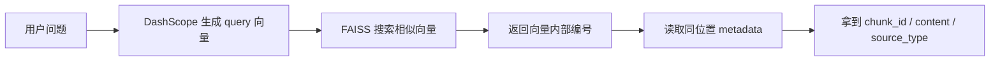

# 03 FAISS 向量库：把知识变成可检索的语义空间

## 本阶段做什么

第 2 阶段把第 1 阶段产出的 `knowledge_base.jsonl` 转成 FAISS 向量库。

具体流程：

1. 读取每条标准知识记录。
2. 取出 `retrieval_text` 作为检索文本。
3. 调用 DashScope `tongyi-embedding-vision-flash-2026-03-06` 生成 768 维向量。
4. 使用 FAISS 保存向量索引。
5. 另存 metadata，用来从向量命中结果回到原始知识 chunk。
6. 用一个测试问题做 top-k 召回验证。

## 为什么要这么做

关键词检索更擅长匹配“原词”，但用户提问经常和知识库里的表达不完全一致。

embedding 的作用是把文本映射到向量空间中，让语义相近的内容距离更近。例如：

```text
用户问：coze 怎么开始用？
知识库写：可以注册并尝试使用 coze 平台进行实践。
```

这两个句子关键词不完全一样，但语义接近，向量检索就有机会把它们召回。

## 当前向量化对象

当前使用 `retrieval_text` 做向量化，而不是只用 `content`。

原因：

- `questions` 是召回别名，能覆盖用户的不同问法。
- `content` 是回答依据，能保证召回结果真正有信息。
- `retrieval_text` 同时包含问题别名和正文，适合第一版 FAISS MVP。

但生成答案时仍然应该优先引用 `content`，不要只拿问题别名回答。

## FAISS 和 metadata 为什么分开

FAISS 保存的是数字向量和内部编号，不适合直接保存中文正文、来源文件、chunk_id 等信息。

所以本项目拆成三类文件：

```text
indexes/faiss/knowledge_base.index
  保存 FAISS 向量索引。

indexes/metadata/knowledge_base_metadata.jsonl
  保存每个向量对应的 doc_id、chunk_id、title、content、source_type 等信息。

indexes/metadata/knowledge_base_manifest.json
  保存本次索引构建参数，例如模型名、维度、记录数、token 用量。
```

检索时的回溯关系是：



## 当前索引策略

当前使用：

```text
IndexFlatIP + L2 normalize
```

含义：

- `IndexFlatIP`：用内积计算相似度。
- `L2 normalize`：先把向量长度归一化。
- 两者组合后，分数可以近似理解为 cosine similarity。

第一版数据只有 2915 条，规模很小，所以先用最容易理解、最容易排查的精确检索索引。
后续如果数据量变大，再考虑 IVF、HNSW 等更复杂的索引。

## 当前 embedding 模型

当前按项目要求使用：

```text
tongyi-embedding-vision-flash-2026-03-06
```

这是一个多模态 embedding 模型。当前知识库主要是文本，所以建库时先把每条 `retrieval_text` 以 `{"text": "..."}` 的形式送入 DashScope `MultiModalEmbedding.call`。

后续如果要把视频知识库里的图片字段也纳入检索，可以在这个基础上扩展成图文融合向量。

## 运行方式

在 `ai_tutor_rag` 目录下运行：

```bash
python build_vector_index.py
```

如果首次只想验证流程，可以先跑小样本：

```bash
python build_vector_index.py --limit 30
```

脚本最后会自动用一个测试问题做召回验证，并打印 top-k 结果。

## 本阶段相关文件

```text
config.py
src/embeddings.py
src/vector_store.py
build_vector_index.py
indexes/faiss/knowledge_base.index
indexes/metadata/knowledge_base_metadata.jsonl
indexes/metadata/knowledge_base_manifest.json
docs/03_FAISS向量库.md
```
