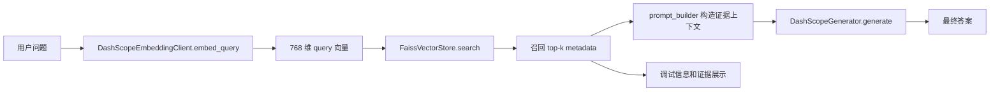
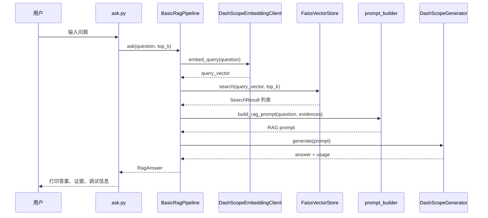

# 03 基础问答链路：先检索证据，再生成答案

## 本阶段做什么

第 3 阶段把前两阶段已经完成的数据和向量库串成一条最小可运行的 RAG 问答链路。

具体流程：

1. 接收用户输入的问题。
2. 调用 DashScope embedding，把用户问题转换成查询向量。
3. 使用 FAISS 从本地向量库召回 top-k 条相关知识。
4. 把用户问题、召回证据和回答要求组装成 prompt。
5. 调用 DashScope LLM，生成基于证据的最终答案。
6. 输出答案、召回证据和调试信息，方便观察 RAG 每一步发生了什么。

## 为什么要这么做

RAG 的核心不是“直接把问题交给大模型”，而是：

```text
先从知识库找证据，再让大模型基于证据回答。
```

如果直接问大模型，模型可能会根据自己的通用知识自由发挥，回答看起来流畅，但不一定来自当前课程知识库。

加入检索链路后，系统回答时会多一个“证据约束”：

- 用户问题负责表达需求。
- FAISS 负责找出相关知识。
- prompt 负责把证据交给 LLM。
- LLM 负责把证据组织成自然语言答案。

这样更符合企业知识库问答、课程助教和客服问答等 RAG 场景的真实架构。

## 当前问答流程



## 第 3 阶段新增模块

```text
src/prompt_builder.py
  负责把 FAISS 召回结果整理成 LLM 能阅读的证据 prompt。

src/generator.py
  负责调用 DashScope LLM，根据 prompt 生成答案。

src/pipeline.py
  负责把 embedding、FAISS、prompt 和 LLM 串成完整问答链路。

ask.py
  命令行测试入口，用来快速验证当前 RAG 系统是否能完成一次问答。
```

## 模块之间如何协作



## prompt 中包含什么

当前 prompt 主要由三部分组成：

```text
1. 回答要求
   告诉模型必须基于证据回答，证据不足时要明确说明。

2. 用户问题
   保留用户原始问题，避免模型只看证据而忘记要回答什么。

3. 召回证据
   包含相似度分数、证据位置、问题别名和正文。
```

其中最重要的是 `正文` 字段，也就是 metadata 中的 `content`。

原因是：

- `questions` 主要用于提高召回率。
- `content` 才是最终回答依据。
- 即使命中了某个问题别名，回答时也应该回到对应正文，而不是只拿问题文本生成答案。

## Prompt 证据格式优化

当前最终发送给 LLM 的召回证据不再包含 `source_type` 和 `title`。

原因是：

- `source_type` 更适合前端筛选和调试，不是回答用户问题的必要依据。
- `title` 通常来自第一条问题别名，容易和 `问题别名` 信息重复。
- 内部 `chunk_id` 对 LLM 可读性不强，所以在 prompt 中改成“源文件名 + 原始 Excel 行号”的形式。

例如，一条证据在最终 prompt 中会类似这样展示：

```text
[证据1]
排序分数: 0.8234
证据位置: video-all.xlsx 文件的第 25 行
问题别名: coze平台怎么注册？；coze怎么开始实践？
正文: ...
```

这里的行号由标准知识库的 `row_index + 1` 得到，因为项目内部 `row_index` 从 0 开始，而展示给人和 LLM 时使用从 1 开始的自然行号。

## 当前为什么不做更复杂能力

第 3 阶段故意保持简单，只完成基础链路：

```text
向量检索 -> 证据 prompt -> LLM 生成
```

暂时不加入：

- query 改写
- 意图识别
- BM25
- 混合检索
- rerank
- 父页面检索

这样做是为了让初学者先看清楚 RAG 的主干流程。后续阶段再逐步加入增强模块时，就能知道每个模块解决的是哪一类问题。

## 当前配置

第 3 阶段在 `config.py` 中新增了生成模型相关配置：

```text
LLM_MODEL = "qwen3.6-flash"
LLM_TEMPERATURE = 0.2
LLM_BASE_URL = "https://dashscope.aliyuncs.com/compatible-mode/v1"
DEFAULT_RETRIEVAL_TOP_K = 5
MAX_CONTEXT_CHARS = 6000
```

含义：

- `LLM_MODEL`：最终生成答案的大语言模型。
- `LLM_TEMPERATURE`：生成随机性，数值越低越稳定。
- `LLM_BASE_URL`：DashScope OpenAI 兼容接口地址，用于调用 Qwen3.6 系列生成模型。
- `DEFAULT_RETRIEVAL_TOP_K`：默认召回多少条证据。
- `MAX_CONTEXT_CHARS`：控制 prompt 中证据上下文的最大长度，避免上下文过长。

## 运行方式

在 `ai_tutor_rag` 目录下运行：

```powershell
python ask.py "coze平台怎么注册并开始实践？" --top-k 3 --show-debug
```

参数说明：

```text
问题文本
  要向 AI 助教提出的问题。

--top-k
  从 FAISS 召回的证据数量。

--show-debug
  打印流程日志、召回摘要和 LLM token 用量，适合学习和排查。
```

如果不传问题，脚本会进入交互式输入：

```powershell
python ask.py
```

## 验证结果

已使用如下命令完成第 3 阶段验证：

```powershell
python -m py_compile config.py src\prompt_builder.py src\generator.py src\pipeline.py ask.py
```

验证内容：

- 新增 Python 文件语法正确。
- 模块之间导入关系正确。

也已执行真实问答验证：

```powershell
python ask.py "coze平台怎么注册并开始实践？" --top-k 3 --show-debug
```

验证结果：

- 成功把用户问题转换成 query 向量。
- 成功从 FAISS 召回 3 条 Coze 相关证据。
- 成功构造包含证据的 prompt。
- 成功调用 `qwen3.6-flash` 生成答案。
- 本次 LLM 调用返回 token 用量：`input_tokens=864`，`output_tokens=135`，`total_tokens=999`。

## 新手需要理解的关键点

### 1. RAG 的答案不是凭空生成的

基础 RAG 链路中，LLM 看到的不只是用户问题，还包括本地知识库召回的证据。

所以更准确的理解是：

```text
LLM 不是知识库本身，而是负责阅读证据并组织答案。
```

### 2. FAISS 返回的是候选证据，不等于最终真相

FAISS 根据向量相似度找出“可能相关”的内容。

这些内容不一定全部都能回答问题，所以 prompt 中要求模型：

- 能回答就基于证据回答。
- 证据不足就明确说明不足。
- 不要编造知识库中没有的信息。

后续 rerank 阶段会继续提高证据质量。

### 3. prompt 是 RAG 系统的重要控制点

同样的召回结果，如果 prompt 写得太松，模型可能会自由发挥。

当前 prompt 明确要求：

```text
只能使用召回证据中的信息。
证据不足时要说证据不足。
引用证据时使用 [证据1]、[证据2] 标注来源。
```

这类约束能让答案更可控，也方便前端展示“答案依据”。

### 4. 调试信息很重要

RAG 系统不好用时，问题不一定出在 LLM，也可能出在：

- 用户问题没有被正确向量化。
- FAISS 召回内容不相关。
- top-k 设置太小或太大。
- prompt 没有清楚告诉模型如何使用证据。

所以第 3 阶段的 `RagAnswer.debug` 会保留流程日志、模型名称、召回数量、证据摘要和 token 用量。
第 4 阶段做 Streamlit 前端时，可以直接把这些信息展示出来。

## 本阶段相关文件

```text
config.py
src/embeddings.py
src/vector_store.py
src/prompt_builder.py
src/generator.py
src/pipeline.py
ask.py
indexes/faiss/knowledge_base.index
indexes/metadata/knowledge_base_metadata.jsonl
docs/03_基础问答链路.md
```
