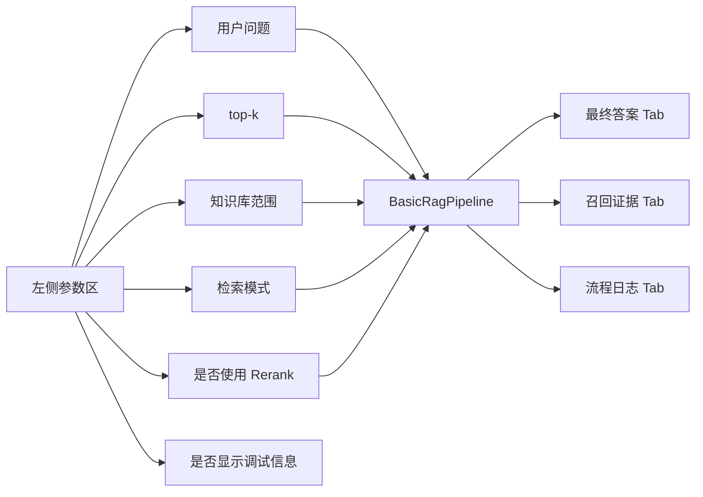
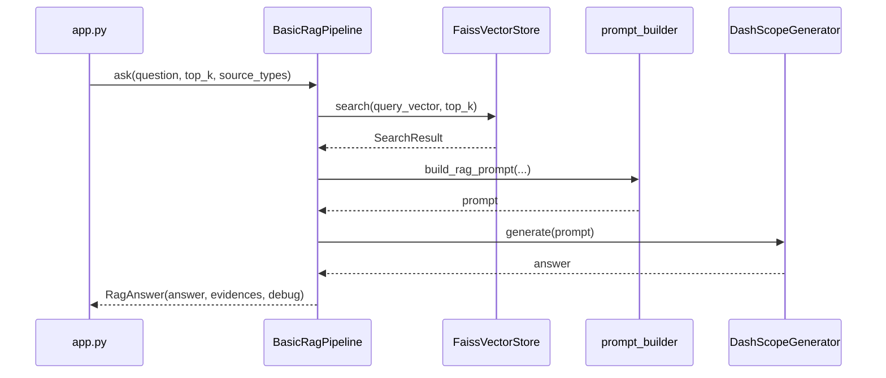

# 04 Streamlit 前端：把 RAG 链路展示出来

## 本阶段做什么

第 4 阶段为 AI 助教 RAG 系统增加一个 Streamlit 调试前端。

页面能力包括：

1. 在左侧输入用户问题。
2. 调整 FAISS 召回数量 top-k。
3. 用复选框选择知识库范围：课程视频、微信群问答。
4. 选择检索模式，并决定是否启用本地 Rerank 重排。
5. 展示最终答案。
6. 展示召回证据摘要和证据正文。
7. 展示检索流程、模型名称、召回数量和 token 用量。

## 为什么要这么做

RAG 系统不应该只做成一个聊天框。

对初学者来说，更重要的是看到系统每一步发生了什么：

- 用户问题是否成功进入检索链路。
- FAISS 召回了哪些 chunk。
- 召回证据和最终答案是否一致。
- LLM 是否真的基于证据回答。
- 本次调用消耗了多少 token。

这些信息能帮助我们判断问题出在检索、prompt 还是生成模型。

## 页面结构



## 前端和后端如何连接

Streamlit 页面本身不直接写 RAG 逻辑，而是调用第 3 阶段已经完成的 `BasicRagPipeline`。

这样拆分有两个好处：

1. 页面只负责交互和展示，代码更容易理解。
2. 后续如果换成 FastAPI、Gradio 或正式 Web 前端，核心问答链路不用重写。

当前调用关系如下：



当前 LLM 使用用户已确认的 `qwen3.6-flash`，调用方式为 DashScope OpenAI 兼容 Chat Completions 接口。

## 知识库范围筛选怎么实现

第 4 阶段还没有引入 BM25、混合检索和 rerank，所以知识库范围筛选先采用一个简单策略。
页面上用两个复选框表示来源范围：两个都勾选就是全库检索，只勾选一个就是只检索该来源。

```text
先用 FAISS 多召回一些候选结果
再根据 metadata.source_type 过滤 video 或 wechat_qa
最后把过滤后的 top-k 证据交给 prompt
```

为什么不直接改 FAISS 索引：

- 当前 FAISS 索引只有 2915 条，规模很小，metadata 层过滤足够清晰。
- 对初学者来说，这种实现更容易理解。
- 后续如果知识库变大，可以再做分库索引或更复杂的过滤检索。

## 页面展示哪些信息

### 1. 最终答案

展示 DashScope LLM 根据召回证据生成的自然语言回答。

最终答案上方会显示“RAG 执行流程”。
系统每完成一个流程节点，就新增一行绿色勾选记录，并标出该节点耗时。

这样用户在等待最终答案前，就能看到系统正在经历：

```text
参数校验与来源清洗
查询向量化
FAISS 向量检索
BM25 关键词检索
混合分数归一化与合并
证据对象整理
Prompt 构造
进入 LLM 流式生成
```

这类展示适合教学和调试：它把 RAG 从“黑箱等待”拆成可观察的工程步骤。

### 2. 召回证据

展示每条证据的：

```text
排名
相似度分数
来源类型
chunk_id
标题
正文预览
完整正文
问题别名
```

这些信息用来判断：模型答案是否有依据，召回内容是否真的相关。

### 召回证据表格的缺失分数

第 5 阶段加入 BM25 和混合检索后，召回证据表格会展示 FAISS 原始分、FAISS 归一分、BM25 原始分和 BM25 归一分。

不同检索模式下，有些分数天然不存在：

- 只用 FAISS 时，没有 BM25 分数。
- 只用 BM25 时，没有 FAISS 分数。
- 混合检索时，某条证据也可能只被其中一路召回。

Streamlit 的 `st.dataframe` 底层会把 pandas 表格转换成 Arrow 表。
如果同一列里同时混入数字和 `"-"` 字符串，Arrow 会尝试把 `"-"` 转成数字并报错。
所以页面表格里用 `None` 表示缺失分数，让它显示为空值；展开某条证据查看详情时，再用 `"-"` 作为人类可读占位符。

### 3. 流程日志

展示当前 RAG 链路的关键步骤：

```text
1. 将用户问题向量化
2. 使用 FAISS 按向量相似度召回证据
3. 把用户问题、召回证据和回答要求组装成 prompt
4. 调用 DashScope LLM 生成基于证据的答案
```

还会展示模型名称、召回数量和 LLM token 用量。

## 运行方式

在 `ai_tutor_rag` 目录下运行：

```powershell
& 'D:\dev_tools\anaconda3\python.exe' -m streamlit run app.py --server.address 127.0.0.1 --server.port 8501
```

然后在浏览器打开：

```text
http://127.0.0.1:8501
```

## 验证方式

第 4 阶段至少需要验证三件事：

1. Python 文件能通过语法编译。
2. Streamlit 应用能正常启动。
3. 页面能打开并看到输入框、参数面板、答案区、证据区和日志区。

建议测试问题：

```text
coze平台怎么注册并开始实践？
```

如果点击“开始提问”后能看到答案、召回证据和流程日志，说明第 4 阶段链路已经跑通。

## 新手需要理解的关键点

### 1. 前端不是 RAG 核心逻辑

`app.py` 只负责展示和收集参数，真正的 RAG 流程仍然在 `src/pipeline.py`。

这是一种常见工程分层：

```text
页面层：负责交互
Pipeline 层：负责业务流程
底层模块：负责 embedding、FAISS、prompt、LLM
```

### 2. 可解释展示比聊天框更重要

如果只展示最终答案，用户很难判断答案是否可靠。

展示召回证据后，用户可以自己检查：

- 证据是否和问题相关。
- 答案是否引用了正确内容。
- 是否需要调整 top-k 或知识库范围。

### 3. 调试信息会服务后续阶段

第 5 阶段加入 BM25 和混合检索后，需要比较不同检索方式的召回结果。

第 6 阶段 query 改写暂缓；如果后续加入，需要展示原始问题和改写问题。

第 7 阶段加入 rerank 后，需要展示重排前后的证据变化。
因此左侧增加“使用 Rerank 重排”开关：

- 开启：检索结果会进入本地 rerank 模型重新排序。
- 关闭：系统直接使用初步检索排序，速度更快，适合对比 rerank 前后的差异。

所以第 4 阶段先把“流程日志展示区”搭起来，后续可以持续扩展。

## 本阶段相关文件

```text
app.py
src/pipeline.py
src/prompt_builder.py
src/generator.py
src/vector_store.py
docs/04_Streamlit前端.md
```
