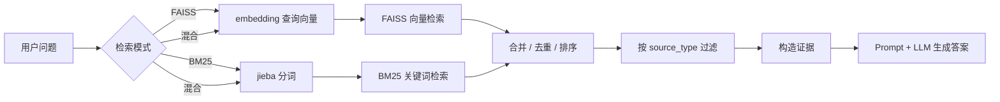

# 05 BM25 和混合检索：同时兼顾关键词与语义

## 本阶段做什么

第 5 阶段为 AI 助教 RAG 系统增加 BM25 关键词检索和混合检索能力。

新增能力包括：

1. 从 `knowledge_base.jsonl` 构建 BM25 关键词索引。
2. 支持 BM25 单独召回证据。
3. 支持 FAISS 和 BM25 分别召回后合并去重。
4. 在命令行和 Streamlit 前端选择检索模式：
   - FAISS 向量检索
   - BM25 关键词检索
   - 混合检索

## 为什么要这么做

FAISS 和 BM25 各有优势：

```text
FAISS：擅长语义相似
BM25：擅长关键词精确匹配
```

例如用户问“coze 平台怎么注册”，FAISS 可能找到“扣子平台实践”这类语义相近内容。
如果用户问的是模型名、工具名、课程术语，BM25 对精确词命中通常更稳。

混合检索的目标不是取代 FAISS，而是让两类召回互相补充：

- 用户说法和知识库说法不同：FAISS 更容易命中。
- 用户包含明确关键词：BM25 更容易命中。
- 两路都命中的 chunk：通常更值得排在前面。

## 本阶段结构



## 新增文件

```text
src/bm25_store.py
src/retriever.py
build_bm25_index.py
docs/05_BM25混合检索.md
```

## BM25 索引保存了什么

BM25 不保存向量，它保存的是：

```text
tokenized_corpus：每条知识记录分词后的 token 列表
metadata：与每条记录对齐的 chunk_id、source_type、title、content 等信息
```

构建脚本读取的是第 1 阶段生成的 `data/processed/knowledge_base.jsonl`。
进入 BM25 的文本优先使用 `retrieval_text`，因为它同时包含：

- questions：问题别名，帮助召回；
- content：最终回答依据。

## 为什么要有 retriever.py

如果把 FAISS、BM25、混合合并逻辑都写在 `pipeline.py` 里，后续会越来越难读。

当前分层是：

```text
pipeline.py
  负责：一次问答流程，从检索到生成

retriever.py
  负责：根据检索模式拿到候选证据

bm25_store.py / vector_store.py
  负责：具体索引的构建、加载和搜索
```

这样后续第 6 阶段加入 query 改写、第 7 阶段加入 rerank 时，只需要在合适层次接入，不会把所有逻辑混在一个文件里。

## 混合检索怎么合并结果

BM25 分数和 FAISS 分数不能直接相加。

原因是：

- FAISS 当前分数接近 cosine similarity。
- BM25 分数来自关键词频次、IDF 和长度归一。
- 两者不是同一个量纲，原始分数大小没有直接可比性。

所以当前使用“候选池内 min-max 归一化 + 加权求和”的融合方式：

```text
faiss_norm = (faiss_raw - faiss_min) / (faiss_max - faiss_min)
bm25_norm = (bm25_raw - bm25_min) / (bm25_max - bm25_min)

final_score = 0.55 * faiss_norm + 0.45 * bm25_norm
```

这里的归一化是“本次候选池内归一化”，不是全库永久分数。
也就是说，每次用户提问时，系统先分别取一批 FAISS 候选和 BM25 候选，
再在这批候选内部把各自分数压到 0 到 1。

为什么这样做：

- 保留 FAISS 和 BM25 各自的强项。
- 避免直接相加两个不同量纲的原始分。
- 前端可以展示原始分、归一分和最终混合分，方便学习者观察排序逻辑。

当前混合检索会先各取 `top_k × 5` 个候选，再融合后返回最终 top-k。
这样候选池更充分，归一化结果也比只在最终几条证据里计算更有参考价值。

需要注意：

- min-max 归一化容易受本次候选中最高分、最低分影响。
- 如果某一路只有一个候选，或者所有候选分数相同，系统会把命中的候选归一为 1。
- 后续加入 rerank 后，可以让 rerank 模型在混合召回结果上再做最终重排。

## 知识库范围筛选

第 4 阶段已经支持在前端选择：

```text
课程视频 video
微信群问答 wechat_qa
```

第 5 阶段继续沿用这个策略：

1. 底层索引先从全库多召回一些候选。
2. retriever 根据 metadata.source_type 做过滤。
3. 最后取用户设置的 top-k 条证据。

这样不需要为每个来源单独维护一套索引，适合当前 2915 条数据规模。

## 运行方式

先构建 BM25 索引：

```powershell
& 'D:\dev_tools\anaconda3\python.exe' build_bm25_index.py
```

命令行验证混合检索：

```powershell
& 'D:\dev_tools\anaconda3\python.exe' ask.py "coze平台怎么注册并开始实践？" --top-k 3 --retrieval-mode hybrid --show-debug
```

验证 BM25 单独检索：

```powershell
& 'D:\dev_tools\anaconda3\python.exe' ask.py "coze平台注册" --top-k 3 --retrieval-mode bm25 --show-debug
```

启动前端：

```powershell
& 'D:\dev_tools\anaconda3\python.exe' -m streamlit run app.py --server.address 127.0.0.1 --server.port 8501
```

## 验证要点

第 5 阶段至少检查：

1. Python 文件语法编译通过。
2. BM25 索引构建成功。
3. BM25 manifest 中记录数为 2915。
4. 命令行实际提问能返回答案和召回证据。
5. 调试信息中能看到当前检索模式、候选数量和混合检索权重。
6. 前端召回证据表格能看到 FAISS 原始分、FAISS 归一分、BM25 原始分、BM25 归一分和最终排序分。
7. 前端“流程日志”中能看到“流程执行时间”，用于观察 embedding 调用、FAISS 检索、BM25 检索、混合合并、prompt 构造和 LLM 生成等节点耗时。
8. 前端“流程日志”中能看到“最终发送给 LLM 的 Prompt”，用于检查用户问题、召回证据和回答规则是如何被组装后交给模型的。

## 流程执行时间怎么看

前端“流程日志”页会在“原始调试数据”下面展示“流程执行时间”表格。

它的作用是帮助判断慢在哪里：

```text
查询向量化：通常代表 DashScope embedding 调用耗时；如果命中查询向量缓存，会显示为本地缓存
FAISS 向量检索：本地向量索引搜索耗时
BM25 关键词检索：本地分词和关键词打分耗时
混合分数归一化与合并：两路召回去重、归一化和加权排序耗时
Prompt 构造：把证据整理成 LLM 输入文本的耗时
LLM API Key 检查：确认本地环境变量是否存在
OpenAI 兼容客户端复用：复用 Pipeline 初始化时创建的 DashScope 兼容客户端
LLM 请求参数组装：构造 system/user messages，并记录 max_tokens、enable_thinking 和 stream 配置
DashScope 流式首块等待：等待远端返回第一个流式响应块，更接近用户看到首字的时间
DashScope 流式响应接收：持续接收模型增量文本，直到完整答案生成结束
LLM 回答文本拼接：把流式 delta 片段合并成完整答案
LLM usage 解析：解析 prompt/completion/total tokens，如果接口返回 reasoning_tokens 也会显示
LLM 模块总耗时：从复用客户端、组装请求到解析完响应的完整 LLM 阶段耗时
RAG 全流程总耗时：从接收问题到拿到答案的端到端耗时
```

这些时间是工程链路耗时，不是模型内部不可见的思考过程。
第 5.1 阶段加入混合检索并行优化后，hybrid 模式下 BM25 会和查询向量化同时执行，
因此子节点耗时相加可能大于“检索阶段总耗时”，这是并行重叠造成的正常现象。
第 5.2 阶段已把最终 LLM 调用改为流式输出。
现在可以观察“流式首块等待”和“流式响应接收”，但仍然无法完全拆出服务端内部排队、模型预填充和逐 token 生成速度。

当前项目还设置了两个生成控制参数：

```text
LLM_MAX_TOKENS = 1000
LLM_ENABLE_THINKING = False
```

它们的目的不是影响检索，而是减少 completion / reasoning tokens 过多导致的等待时间。
`LLM_ENABLE_THINKING=False` 会通过 OpenAI 兼容接口的 `extra_body={"enable_thinking": False}` 传给 DashScope，
适合当前这种“基于证据短答”的 RAG 场景。

## 当前阶段边界

本阶段不做 query 改写、rerank 和父页面扩展。

原因是学习路径要保持清晰：

```text
第 5 阶段：先理解“召回来源变多了”
第 6 阶段：再让用户问题变得更适合检索
第 7 阶段：再对初步召回结果做重排
```

这样每一层变化都能被观察和验证。
